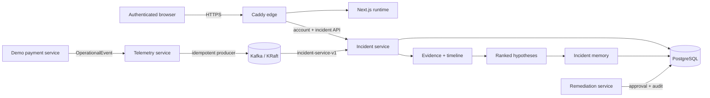

# Causora

**Explainable incident intelligence from telemetry to remediation—running on a deliberately small AWS footprint.**

[Live application](https://13-207-12-164.sslip.io/) · [Health](https://13-207-12-164.sslip.io/health) · [Architecture](docs/architecture.md) · [Deployment guide](docs/deployment.md)

The former GitHub Pages URL remains as a zero-cost redirect so existing portfolio links continue to work; the application itself runs dynamically on the HTTPS host above.

Causora is an event-driven incident investigation platform. It turns structured operational events into durable incidents, correlates evidence, builds an ordered timeline, ranks competing root-cause hypotheses, and keeps remediation behind a human approval boundary.

## What is live

- A containerized Next.js workspace served from the same HTTPS origin as the API.
- PostgreSQL accounts, BCrypt password hashes, role-based authorization, CSRF protection, and persistent server-side sessions.
- 100 PostgreSQL-backed incidents processed through Telemetry → Kafka → Incident Service.
- Evidence correlation by trace, deployment, service, and time window.
- Deterministic hypotheses with supporting and counter-evidence IDs.
- Immutable incident memory for resolved investigations.
- Approval-controlled remediation proposals with execution disabled by default.
- CI verification for the Maven reactor, frontend types, production build, container build, and dependency audit.

## Architecture



Only Caddy receives public traffic. Incident reads require an authenticated `VIEWER`, `OPERATOR`, or `ADMIN` account. Telemetry ingestion, remediation writes, database access, Kafka, actuator metrics, and application ports remain private.

## Stack

| Layer | Technology |
| --- | --- |
| Frontend | Next.js 16, React 19, TypeScript, Tailwind CSS, Node.js 22 |
| Security | Spring Security, BCrypt, Spring Session JDBC, CSRF, roles |
| Services | Java 21, Spring Boot 3.5, Maven |
| Messaging | Apache Kafka 3.7 in KRaft mode |
| Persistence | PostgreSQL 16, JPA, Flyway |
| Edge | Caddy with automatic TLS and strict security headers |
| Runtime | Docker Compose on ARM64 Amazon Linux 2023 |
| Infrastructure | Terraform, AWS EC2, Systems Manager |
| Delivery | GitHub Actions, Dependabot |

## Authentication and authorization

New accounts receive the `VIEWER` role. Passwords must be 12–64 characters and are stored only as BCrypt hashes. Successful login creates a secure, HTTP-only, SameSite session cookie; session state is stored in PostgreSQL and expires after eight hours. All state-changing account requests require a CSRF token.

| Route | Access |
| --- | --- |
| `GET /api/v1/auth/csrf` | Anonymous bootstrap |
| `POST /api/v1/auth/register` | Anonymous + CSRF |
| `POST /api/v1/auth/login` | Anonymous + CSRF |
| `GET /api/v1/auth/me` | Authenticated |
| `POST /api/v1/auth/logout` | Authenticated + CSRF |
| `GET /api/v1/incidents/**` | `VIEWER`, `OPERATOR`, or `ADMIN` |
| Remediation and telemetry routes | Not exposed publicly |

Promote a trusted account from the private host only:

```sql
UPDATE user_accounts SET role = 'OPERATOR' WHERE email = 'operator@example.com';
```

## Core engineering properties

### Idempotent delivery

The event ID is both the Kafka message key and a unique PostgreSQL field. Replayed messages are observable but cannot create duplicate incidents or evidence. The Kafka producer uses `acks=all`, idempotence, bounded in-flight requests, retries, and compression.

### Explainable investigation

Hypothesis scores use explicit rules for direct evidence, ordering, shared deployment correlation, secondary symptoms, and recovery counter-evidence. Every score points back to its supporting and contradicting evidence; no opaque model is required for the current result.

### Safe remediation

Only allowlisted playbook keys can be proposed. Decisions require an actor, transitions are one-way, and every decision or blocked execution attempt is persisted. Execution remains disabled until authenticated approval and a constrained adapter are deployed.

### Bounded external surface

- Incident list requests are clamped to 1–200 records.
- Account and incident responses are marked `no-store` at the edge.
- Session cookies are secure, HTTP-only, and SameSite Strict.
- CSP, HSTS, anti-framing, MIME-sniffing, permissions, and crawler protections are applied at the edge.
- No database, Kafka, telemetry, remediation, or actuator port is publicly routed.

## Run locally

Requirements: Java 21, Maven 3.9+, Node.js 22+, and Docker Compose.

```bash
mvn clean verify
cp .env.example .env
# Replace POSTGRES_PASSWORD with a unique long value.
docker compose up --build
```

Open `http://localhost`, create an account, and sign in. Generate a deterministic five-event investigation:

```bash
curl -X POST http://127.0.0.1:8090/demo/scenarios/database-failure
```

Run the frontend separately for development:

```bash
cd frontend
npm ci
npm run typecheck
npm run dev
```

Next.js proxies `/api/*` to `http://localhost:8082` during local development. For an HTTP-only non-local development hostname, temporarily override the secure-cookie setting in the Incident Service; never disable it in production.

## Verify

```bash
mvn clean verify
cd frontend
npm ci
npm audit --audit-level=high
npm run typecheck
npm run build
docker build .
```

Service metrics remain private at `/actuator/prometheus`. Tests cover account behavior, authorization boundaries, CSRF, validation, controllers, persistence, event idempotency, investigation, memory, similarity, and remediation safety.

## Cloud footprint and cost guardrail

The deployed system stays on one `t4g.small` instance with one encrypted 16 GiB gp3 volume. Next.js, the Java services, Kafka, PostgreSQL, and Caddy share that host with explicit memory limits. This uses existing spare capacity rather than adding a managed identity service or another server.

No Cognito, Auth0, NAT Gateway, load balancer, RDS, MSK, EKS, ElastiCache, managed monitoring stack, paid AI API, or second EC2 instance is used. The expected continuous cost remains approximately **$13–14/month**, subject to AWS pricing, taxes, and data transfer.

## Repository map

```text
causora-events/                 Shared immutable event contract
services/telemetry-service/    Validation and Kafka publishing
services/incident-service/     Accounts, security, incidents, investigation, memory
services/remediation-service/  Approval and audit control plane
demo/                           Deterministic failure scenarios
frontend/                       Dynamic authenticated incident workspace
infrastructure/terraform/       Low-cost AWS foundation
docs/                           Architecture and operations
```
