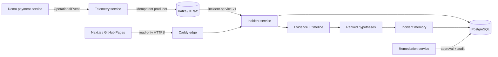

# Causora

**Explainable incident intelligence from telemetry to remediation—running on a deliberately small AWS footprint.**

[Live dashboard](https://varad11102.github.io/causora-incident-platform/) · [API status](https://13-207-12-164.sslip.io/) · [Architecture](docs/architecture.md) · [Deployment guide](docs/deployment.md)

Causora is an event-driven incident investigation platform. It turns structured operational events into durable incidents, correlates evidence, builds an ordered timeline, ranks competing root-cause hypotheses, and keeps remediation behind a human approval boundary.

## What is live

- A polished Next.js command center deployed to GitHub Pages.
- A public HTTPS API with bounded, read-only incident access.
- 100 PostgreSQL-backed incidents processed through Telemetry → Kafka → Incident Service.
- Evidence correlation by trace, deployment, service, and time window.
- Deterministic hypotheses with supporting and counter-evidence IDs.
- Immutable incident memory for resolved investigations.
- Approval-controlled remediation proposals with execution disabled by default.
- CI verification for the Maven reactor, frontend types, production export, and dependency audit.

## Architecture



The public edge allows only `GET` and `OPTIONS` for incident resources. Telemetry ingestion, remediation writes, database access, Kafka, actuator metrics, and application ports remain private.

## Stack

| Layer | Technology |
| --- | --- |
| Frontend | Next.js 16, React 19, TypeScript, Tailwind CSS |
| Services | Java 21, Spring Boot 3, Maven |
| Messaging | Apache Kafka 3.7 in KRaft mode |
| Persistence | PostgreSQL 16, JPA, Flyway |
| Edge | Caddy with automatic TLS and strict security headers |
| Runtime | Docker Compose on ARM64 Amazon Linux 2023 |
| Infrastructure | Terraform, AWS EC2, Systems Manager |
| Delivery | GitHub Actions, GitHub Pages, Dependabot |

## Core engineering properties

### Idempotent delivery

The event ID is both the Kafka message key and a unique PostgreSQL field. Replayed messages are observable but cannot create duplicate incidents or evidence. The Kafka producer uses `acks=all`, idempotence, bounded in-flight requests, retries, and compression.

### Explainable investigation

Hypothesis scores use explicit rules for direct evidence, ordering, shared deployment correlation, secondary symptoms, and recovery counter-evidence. Every score points back to its supporting and contradicting evidence; no opaque model is required for the current result.

### Safe remediation

Only allowlisted playbook keys can be proposed. Decisions require an actor, transitions are one-way, and every decision or blocked execution attempt is persisted. Execution remains disabled until authenticated approval and a constrained adapter are deployed.

### Bounded public surface

- Incident list requests are clamped to 1–200 records.
- The aggregate overview provides real counts without fabricated dashboard metrics.
- CORS permits the deployed GitHub Pages origin.
- CSP, HSTS, anti-framing, MIME-sniffing, permissions, and crawler protections are applied at the edge.

## Public API

```bash
curl https://13-207-12-164.sslip.io/
curl https://13-207-12-164.sslip.io/health
curl 'https://13-207-12-164.sslip.io/api/v1/incidents?limit=20'
curl https://13-207-12-164.sslip.io/api/v1/incidents/overview
curl https://13-207-12-164.sslip.io/api/v1/incidents/{incidentId}/evidence
curl https://13-207-12-164.sslip.io/api/v1/incidents/{incidentId}/hypotheses
curl https://13-207-12-164.sslip.io/api/v1/incidents/{incidentId}/similar-memory?limit=5
```

Public POST, PUT, PATCH, DELETE, telemetry, and remediation routes are intentionally unavailable.

## Run locally

Requirements: Java 21, Maven 3.9+, Node.js 20.9+, and Docker Compose.

```bash
mvn clean verify
cp .env.example .env
# Replace POSTGRES_PASSWORD with a unique long value.
docker compose up --build
```

The local edge defaults to `http://localhost`. Generate a deterministic five-event investigation:

```bash
curl -X POST http://127.0.0.1:8090/demo/scenarios/database-failure
curl http://127.0.0.1:8082/api/v1/incidents
```

Run the frontend separately:

```bash
cd frontend
npm ci
npm run typecheck
npm run build
npm run dev
```

## Verify

```bash
mvn clean verify
cd frontend
npm ci
npm audit --audit-level=high
npm run typecheck
npm run build
```

Service metrics are available privately at `/actuator/prometheus`. The repository includes unit, controller, repository, persistence, idempotency, investigation, memory, similarity, and remediation safety tests.

## Cloud footprint and cost guardrail

The deployed system intentionally stays on one `t4g.small` instance with one encrypted 16 GiB gp3 volume. Kafka and PostgreSQL run inside the same Compose network. GitHub Pages hosts the static frontend at no additional AWS compute cost.

No NAT Gateway, load balancer, RDS, MSK, EKS, ElastiCache, managed monitoring stack, or paid AI API is used. The expected continuous cost remains approximately **$13–14/month**, subject to AWS pricing, taxes, and data transfer.

## Repository map

```text
causora-events/                 Shared immutable event contract
services/telemetry-service/    Validation and Kafka publishing
services/incident-service/     Detection, correlation, hypotheses, memory
services/remediation-service/  Approval and audit control plane
demo/                           Deterministic failure scenarios
frontend/                       Static incident command center
infrastructure/terraform/       Low-cost AWS foundation
docs/                           Architecture and operations
```
