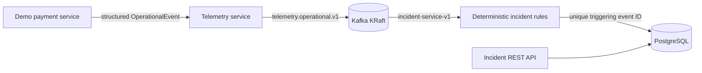
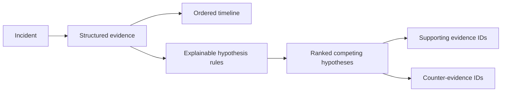

# Causora Architecture

## Current shape

Causora has five independently buildable Spring Boot services and a Next.js frontend. The first working AWS slice runs Kafka, PostgreSQL, Telemetry Service, Incident Service, and the demo payment service on one low-cost ARM64 EC2 instance with Docker Compose.

## Planned service boundaries

| Service | Responsibility |
| --- | --- |
| Gateway | External API entry point and future cross-cutting policy enforcement |
| Telemetry Service | Receive and normalize telemetry and operational events |
| Incident Service | Detect, create, and manage incidents |
| Investigation Service | Collect structured evidence, generate and rank hypotheses, track confidence and counter-evidence, and later call provider-independent AI |
| Remediation Service | Recommend actions, require human approval, execute Ansible, and verify recovery |

## Planned first data flow

```text
Demo service
  -> OpenTelemetry
  -> Telemetry Service
  -> Kafka
  -> Incident Service
  -> Incident detected
```

Phase 1 implements the direct demo event path (OpenTelemetry instrumentation remains a later phase):

```text
demo-payment-service (:8090)
  -> POST OperationalEvent
telemetry-service (:8081)
  -> validation and normalization
Kafka: telemetry.operational.v1 (JSON)
  -> consumer group incident-service-v1
incident-service (:8082)
  -> failure policy and event-ID idempotency
PostgreSQL (:5432, causora_incidents)
```

Kafka is one KRaft broker with only the internal Compose listener at `kafka:29092`. Flyway owns the incident schema; Hibernate uses schema validation rather than automatic production DDL. PostgreSQL and Kafka have no host port bindings. Application diagnostic ports bind to `127.0.0.1` and are reached through SSM commands.



The event ID is the Kafka key and a unique database field. Re-delivery is therefore observable and idempotent: the consumer records `incident_duplicate_ignored` and does not create another incident.

## Deterministic investigation foundation



Pre-incident telemetry is retained without an incident link. When a triggering failure creates an incident, matching trace or deployment evidence from the preceding ten minutes is linked and receives timeline entries. Subsequent events correlate by trace ID, deployment ID, or a recent open incident for the same service.

Current hypothesis types are database connectivity failure, bad deployment, Kafka consumer degradation, and resource exhaustion. Scores use documented fixed weights: direct evidence, temporal correlation, shared deployment correlation, secondary symptoms, and negative recovery evidence. Scores are clamped to 0–100 and recomputed whenever correlated evidence arrives.

Recovery evidence closes the lifecycle deterministically by changing the linked incident from `OPEN` to `RESOLVED`. Evidence, timeline entries, and hypotheses remain available for audit and future incident-memory retrieval.

Incident-memory retrieval is deterministic and local. It ranks resolved incidents using an explicit 100-point score: matching highest-ranked cause (45), overlapping services (30), shared evidence types (20), and the same deployment identifier (5). The API returns the component scores and reasons; it does not use embeddings, vector storage, or AI.

## Metrics foundation

Telemetry Service, Incident Service, and the demo service expose Micrometer Prometheus endpoints on their loopback-bound application ports. They include application-tagged JVM, HTTP, Kafka-client, process, and system measurements. A Prometheus/Grafana runtime is intentionally deferred until the host memory budget can accommodate it.

## Incident memory

Resolution creates an immutable memory snapshot once per incident. The snapshot selects the highest deterministic hypothesis and records symptoms, evidence summaries, deployment ID, affected services, inferred remediation, and the recovery result. Replayed recovery evidence cannot overwrite the snapshot because both evidence event IDs and memory incident IDs are unique.

Memory remains relational and inspectable in PostgreSQL. Vector search and AI-based similarity are deliberately deferred until the evidence corpus is large enough to justify them.

## Planned investigation flow

```text
Incident
  -> collect evidence
  -> generate hypotheses
  -> rank hypotheses
  -> AI verification
  -> root-cause report
```

AI output will not be a plain log summary. Investigations will be represented using evidence, hypotheses, confidence scores, causal relationships, and counter-evidence. The AI integration will be provider-independent, with Amazon Bedrock support considered later.

## Planned remediation flow

```text
Root cause
  -> recommended remediation
  -> human approval
  -> Ansible
  -> managed node
  -> recovery verification
```

Managed-node containers will initially simulate multiple Linux/Ansible targets.

## Initial demonstration scenarios

1. Kafka consumer lag after a bad deployment.
2. Database or SSL failure after a certificate/configuration change.
3. Resource exhaustion causing latency, timeouts, and downstream failures.
